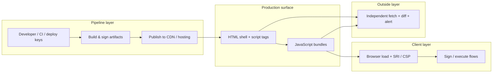
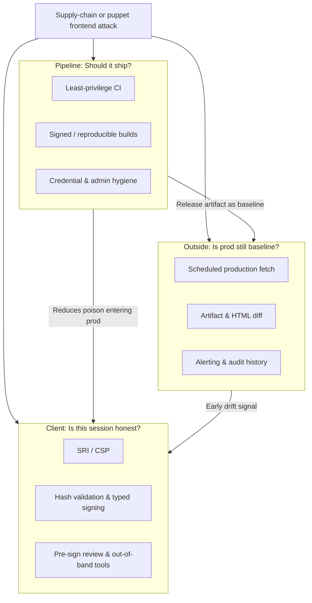

# Defense in depth for frontend integrity: pipeline, client-side, and outside monitoring

In February 2025, roughly **$1.4–1.5 billion** was stolen from Bybit's cold-wallet operations. Forensic investigations traced the root cause not to a Safe smart-contract bug, but to **malicious JavaScript served from Safe{Wallet}'s frontend infrastructure**. Signers saw one transaction on screen while the application silently altered what was actually signed—the **"puppet" attack**.

That incident reframed a question every Web3 and high-trust web team must answer:

> **If the application layer can lie, what actually protects the user?**

The honest answer is **no single control is enough**. Different parts of the attack chain require different guardrails. Some belong in the **release pipeline**. Some run **inside the user's browser at load and sign time**. Some must observe production **from the outside**, independent of the victim's session.

This post maps that landscape: what each layer defends, what it cannot defend, and why **outside monitoring**—the product direction OArmour is built around—is a reasonable and necessary supplement to pipeline hardening and client-side integrity checks like Subresource Integrity (SRI).

**Scope:** We focus on *frontend integrity* failures—compromised or dishonest client code that misleads users about intent—using the Safe{Wallet} incident as the anchor case study. We do not attempt a full catalogue of application security (authentication, API hardening, smart-contract audits, etc.). Those matter, but they address different threat models.

For incident-specific Safe{Wallet} mitigations and implementation detail, see our companion posts on [post-incident hardening](/blog/safe-wallet-february-2025-frontend-compromise-security-changes) and [how Safe{Wallet} implements SRI](/blog/how-safe-wallet-implements-sri).

---

## The attack chain: three places things go wrong

The February 2025 failure mode is a useful template because it hit every layer at once:

| Stage | What happened | Why it mattered |
|---|---|---|
| **1. Pipeline / identity compromise** | Attackers gained access via a compromised developer workstation and build/deploy paths | Malicious artifacts could be built and published as if they were legitimate releases |
| **2. Production assets changed** | Malicious JavaScript was injected into files served to users | The running app—not a network MITM on one user—became the attacker |
| **3. User session exploited** | Payload stayed dormant until specific wallet conditions were met; UI showed benign intent while signing data was altered | Multisig policy and hardware wallets could not save signers from a lying interface |
| **4. Rapid cleanup** | Malicious assets were removed within minutes of execution | Post-incident forensics and user-side detection windows were extremely narrow |

The blunt lesson from Safe{Wallet}'s own post-mortem work:

> **Multisig does not protect you from an application that lies.**

Every serious response therefore spans **upstream** (stop poison from entering releases), **at the edge of the user** (detect tampering and lies during load and sign), and **outside** (observe what production actually serves over time). Skip any one layer and a whole class of attacker moves becomes viable again.

---

## Layer 1: Pipeline guardrails — prevent poison from shipping

**Question this layer answers:** *Did this artifact come from our trusted build process, on an expected commit, signed by expected identities?*

Pipeline controls operate **before and during release**. Their job is to shrink the set of people and machines that can turn source code into production bytes, and to leave an auditable trail when they do.

### What belongs here

| Control | Intent | Example from industry practice |
|---|---|---|
| **Least-privilege CI/CD** | Limit who can merge, deploy, and read secrets | Restricted GitHub Actions permissions, environment protection rules, separate prod deploy roles |
| **Short-lived, scoped credentials** | Stolen long-lived tokens should not equal full prod access | OIDC to cloud providers instead of static cloud keys in CI |
| **Secret hygiene & rotation** | Compromised workstation should not permanently own the pipeline | Rotate deploy keys, API tokens, and admin credentials after incidents or role changes |
| **Signed releases & attestations** | Third parties can verify provenance | GPG-signed release commits, Sigstore/cosign artifact attestation, SBOM publication |
| **Reproducible builds** | Anyone can rebuild from source and compare digests | Same commit + pinned toolchain → same artifact hash; mismatch implies build-environment tampering |
| **Deploy verification endpoints** | Users and operators can check what version is live | Public `/version.json` or equivalent tied to signed release metadata |
| **Admin account hardening** | Hosting/CDN/console access cannot become a shadow deploy path | MFA, no shared root accounts, break-glass procedures, audit logs on object storage |

Safe{Wallet}'s post-incident infrastructure work includes **GPG-signed release commits**, **CI permission hardening**, **`/version.json` for deploy verification**, and **artifact attestation in CI**—all squarely in this layer.

### What this layer defends against

- Compromised developer machines pushing malicious builds through normal release channels
- Insider or stolen CI credentials publishing arbitrary artifacts
- Undetected drift between "what we think we shipped" and "what object storage actually contains"
- Silent substitution of build outputs between CI and CDN

### What this layer cannot do alone

Pipeline controls assume you **control and monitor the pipeline**. They do not:

- Detect **CDN or storage compromise** that bypasses CI (stale credentials on a bucket, compromised CDN admin)
- Catch **short-lived tampering** that reverts before the next deploy
- Protect a user **right now** if poison is already live and a signer is mid-flow
- Help a **third-party treasury team** that does not operate your CI but must trust your frontend

Pipeline guardrails are **necessary and foundational**. They are not sufficient—especially when attackers already sit upstream of every hash your browser will later trust.

---

## Layer 2: Client-side guardrails — detect tampering and lies at load and sign time

**Question this layer answers:** *In this browser session, does what the user see match what will be signed—and did the files we load match what this page claims?*

Client-side controls run **in the user's browser** (or signing device) at **resource load time** and **immediately before high-risk actions**. They are the closest thing to a direct antidote for puppet UI attacks—**when the first code to execute is honest**.

### Subresource Integrity (SRI)

SRI binds a script's content to a cryptographic digest declared on the `<script>` tag (or set before insertion for dynamic chunks). If bytes on the wire or in CDN storage do not match, the browser **refuses to execute** the file.

**Why it exists:** Most frontend compromises in the wild are still **post-build substitution**—swap a chunk in storage, poison a cache, MITM a static path. SRI makes that class fail loudly at load time.

**Why it matters after February 2025:** Safe{Wallet} serves a large webpack/Next.js surface with lazy-loaded chunks. Standard HTML-only SRI misses runtime-loaded scripts; their [#5199](https://github.com/safe-global/safe-wallet-monorepo/pull/5199) and [#7026](https://github.com/safe-global/safe-wallet-monorepo/pull/7026) work closes that gap with manifest-based integrity for dynamic imports.

**Critical limitation:** SRI verifies consistency between **the hash embedded in HTML (or manifest)** and **the downloaded file**. If the attacker **controls the build pipeline**, they produce **fresh, valid hashes for malicious files**. SRI still "passes"—it was never designed to prove moral intent, only byte-level consistency with the page's claims.

See [How Safe{Wallet} implements SRI](/blog/how-safe-wallet-implements-sri) for the technical split between static scripts, route chunks, and webpack lazy loading—and where Next.js App Router still leaves gaps.

### Content Security Policy (CSP)

CSP constrains **where scripts may load from** and whether inline script runs. Tighter `script-src` reduces XSS blast radius—the classic path to reinject signing-layer manipulation in an already-honest app.

**Trade-off:** Real products often reintroduce `'unsafe-inline'` for analytics or legacy integrations, partially rolling back the benefit. CSP is defense in depth, not a silver bullet.

### Transaction hash validation and structured signing

Safe{Wallet}'s **`safeTxHash` vs `txData` validation** ([`useValidateTxData`](https://github.com/safe-global/safe-wallet-monorepo/blob/dev/apps/web/src/hooks/useValidateTxData.ts)) blocks signing when displayed fields disagree with the hash being signed. Removing blind **`eth_sign`** fallback in favor of **EIP-712 typed data** raises the bar for silent substitution.

**Why it exists:** Even with perfect transport integrity, **application logic** can lie. Hash validation targets the puppet pattern directly.

**Limitation:** This logic is itself JavaScript. If **the entire first-party bundle is malicious**, attacker code can patch or bypass checks before they run, or race the signing stack.

### Pre-sign review (simulation, warnings, independent tools)

Safe Shield, Blockaid simulation, expandable raw calldata, and links to **[OpenZeppelin Safe Utils](https://safeutils.openzeppelin.com/)** add **human and automated speed bumps** at the moment of signing.

**Why it exists:** Speed bumps are a feature. They force attention when heuristics or independent recomputation disagree with the UI.

**Limitation:** Tools invoked **from the same compromised UI** can be lied to about inputs. Out-of-band verification (Safe Utils in a separate tab, hardware wallet screens, custom scripts) remains essential for treasury operations.

### Client layer summary

| Control | Primary threat | Fails when |
|---|---|---|
| **SRI** | CDN/storage/wire tampering after an honest build | Pipeline produces malicious artifacts with matching hashes |
| **CSP** | XSS and unauthorized script injection | Policy weakened; attacker controls first-party bundle |
| **Hash validation** | UI ≠ signed payload ("puppet") | Malicious bundle disables or bypasses validation first |
| **Simulation / Shield** | Hidden malicious call patterns | Simulation fed dishonest context; user ignores warnings |
| **Independent hash tools** | Same-app trust collapse | User skips out-of-band checks under time pressure |

Client-side guardrails are **high leverage and mandatory** for wallet-grade surfaces. They protect millions of everyday load paths. They are still **downstream of HTML and build output**—which is exactly where a pipeline attacker stands.

---

## Layer 3: Outside monitoring — observe production without trusting the victim's browser

**Question this layer answers:** *What is production actually serving right now—and how does that compare to a baseline we trust?*

Outside monitoring treats the **live site as an artifact to be measured**, the same way security teams scan container images or dependency graphs. An independent observer (cron job, regional fetchers, third-party service) periodically:

1. **Fetches** production HTML and referenced static assets (or key routes and chunks)
2. **Hashes and diffs** them against known-good releases, prior snapshots, or public source builds
3. **Alerts** on unexpected script origins, new inline handlers, integrity attribute removal, chunk graph changes, or DOM patterns associated with wallet flows
4. **Retains history** so **short-lived tampering** remains visible after attackers clean up

This is not "replace SRI." It is **orthogonal telemetry** from a vantage point the attacker does not control simply because they compromised one user's laptop.

### Why outside monitoring exists

Three properties of the February 2025 class of attack make outside observation especially important:

**1. The attacker may already own the pipeline.**  
When malicious JS is built and deployed through normal channels, **every client-side check is authored by the adversary**. SRI passes. CSP may still pass. In-app hash validation can be neutered in the same bundle. An **external baseline** asks a different question: *does what the world sees match what we published in git tag v1.51.0?*

**2. Tampering can be targeted and ephemeral.**  
Dormant payloads that activate only for specific addresses—and assets removed within minutes—are designed to **evade user reports and casual log review**. Outside monitors with **continuous history** capture snapshots even when no victim was online at the right moment.

**3. Treasury teams do not run your CI.**  
A Bybit-style operator must trust Safe{Wallet}'s frontend without merge access to `safe-wallet-monorepo`. They can use Safe Utils at sign time—but they also benefit from **independent assurance that production has not drifted** since the release they approved. Outside monitoring is how **downstream trust** scales beyond "we hope their deploy pipeline is fine."

### What outside monitoring detects that other layers miss

| Signal | Pipeline controls | Client SRI | Outside monitoring |
|---|---|---|---|
| Malicious build signed and deployed via CI | ⚠️ Partially (if attestation + review catches it) | ❌ Passes | ✅ Diff vs expected release artifact |
| Bucket/CDN swap bypassing CI | ❌ | ✅ If HTML integrity unchanged but chunk swapped | ✅ Hash mismatch vs last good snapshot |
| Short-lived prod tampering reverted in minutes | ❌ | ❌ Unless a user loads during window | ✅ Snapshot retained |
| New third-party script domain in HTML | ❌ | ⚠️ Depends on CSP | ✅ Domain / tag diff alerts |
| Extension-style permission or behavior drift | N/A for web apps | ❌ | ✅ Same diff methodology as extension monitoring |

### What outside monitoring does not replace

Outside monitoring is **detective and deterrent**, not a real-time inline execution blocker:

- It does not **prevent** a single victim's browser from executing poison **in the seconds before an alert fires**—client-side controls and operational signing discipline still matter.
- It requires a **trusted baseline** (official release, signed artifact, or prior snapshot). If baselines are wrong or stale, diff noise erodes trust.
- It must be **operationally owned**—someone must respond to alerts, run playbooks, and coordinate with the vendor's incident channel.

The goal is to **shorten mean time to detect (MTTD)** for production integrity failures and to give **downstream users a watchdog they do not have to build themselves**.

---

## One incident, three different questions

Mapping controls to **questions** clarifies why stacks look redundant but are not:

| Layer | Core question | Representative controls |
|---|---|---|
| **Pipeline** | *Should this artifact exist at all?* | Signed releases, reproducible builds, CI hardening, admin MFA, deploy attestations |
| **Client** | *In this session, are files and signing intent consistent?* | SRI, CSP, `safeTxHash` validation, EIP-712, Safe Shield, hardware clear-signing |
| **Outside** | *Is production still what we think it is?* | Independent fetch, content hash diff, HTML/JS drift alerts, historical retention |

No layer answers all three questions. **Pipeline** reduces how often poison ships but cannot prove CDN fidelity hour by hour. **Client** protects the individual load path but trusts the page's bootstrap. **Outside** watches the shared production surface but does not block execution inside the browser.

---

## Why OArmour belongs in this landscape

OArmour's existing product monitors **Chrome extensions**—version releases, static analysis, domain drift, optional AI browser testing, and subscriber alerts when risk changes. That methodology maps naturally to **web frontend integrity**, the same failure class as the Safe incident:

- **Extensions and web apps both ship executable JavaScript** that users trust with high-value actions.
- **Supply-chain compromise** can alter either a `.crx` zip or a `_next/static/chunks/*.js` bundle.
- **Downstream users and treasury teams** need **someone else watching** because they cannot audit every deploy.

OArmour is deliberately a **supplement**, not a replacement, for vendor-owned pipeline controls and client-side hardening:

| Role | Owner | OArmour's relationship |
|---|---|---|
| Secure CI, signed releases, reproducible builds | **Product vendor** (e.g. Safe, wallet team) | OArmour does not merge your PRs or rotate your CI keys; it **verifies what reached production** against expectations |
| SRI, CSP, in-app validation, signing UX | **Product vendor** | OArmour does not patch your webpack config; it **detects when live HTML/JS diverges** from the release you thought you shipped |
| Out-of-band signer discipline | **Operator / treasury** | OArmour **raises early warning** so signers have fewer "unknown unknown" days |

### What OArmour adds that the other layers leave open

1. **Independent vantage point** — Measurement from infrastructure the victim's browser never touches; resilient to a malicious first-party bundle telling the user "all good."
2. **Continuous history** — Append-only snapshots that survive **hit-and-run** tampering cleaned up before user reports arrive.
3. **Downstream trust at scale** — Wallet teams, exchanges, and security subscribers can monitor **vendor frontends they depend on** without operating those vendors' pipelines.
4. **Same playbooks as extension monitoring** — Version diff, domain and script surface changes, enrichment, alerting, and optional deeper behavioral testing—proven workflow, new artifact type (production web surface).

OArmour should exist for the same reason virus scanners coexist with code signing, and external auditors coexist with internal controls: **trust, but verify—from outside the trust boundary.**

---

## Conclusion

The February 2025 Safe{Wallet} incident was a **frontend integrity and supply-chain** failure. Multisig, hardware wallets, and smart-contract correctness were never the weak link—the **application layer lied**, and the pipeline that fed it had already been breached.

A serious response requires **defense in depth across three surfaces**:

1. **Pipeline** — Stop unauthorized artifacts from shipping; prove provenance with signing, attestation, and reproducible builds; protect admin and CI identities as crown jewels.
2. **Client** — At load time, refuse tampered scripts (SRI) and shrink injection (CSP). At sign time, refuse inconsistent intent (hash validation, typed signing, simulation, out-of-band tools).
3. **Outside** — Continuously measure production HTML and JavaScript against trusted baselines; alert on drift; retain history for ephemeral attacks.

**SRI is essential** for CDN and storage tampering. **It is not an answer to pipeline compromise**, because the attacker can ship malicious bytes with valid integrity metadata. **Pipeline controls are essential** but cannot watch every byte served every minute or protect operators who do not run your CI. **Client validation is essential** but runs inside code that a total bundle compromise can subvert.

**Outside monitoring is therefore reasonable and necessary**: it is the layer that asks, *independent of any single user session, is the public frontend still the product we approved?* It closes the gap between "we rebuilt CI" and "we know production did not silently change at 3 a.m."

OArmour fits that gap. Built on extension monitoring—release diffing, domain intelligence, alerting—it extends the same discipline to **production web surfaces** wallet users and security teams already depend on. Not instead of SRI or signed releases, but **alongside them**, as the third leg of a stool: **build it right, load it honestly, and watch it stay that way.**

---

## Summary table

| Layer | When it acts | Stops / detects | Does not stop |
|---|---|---|---|
| **Pipeline** | Build & deploy | Unauthorized releases; unproven artifacts; weak secret hygiene | Live CDN swap; ephemeral prod edits; in-session puppet UI |
| **Client (SRI, CSP, signing checks)** | User load & sign | Wire/storage chunk tampering; many XSS paths; UI ≠ hash mismatches | Malicious but self-consistent builds; bypassed in-app checks |
| **Outside monitoring** | Continuous prod observation | Drift from baseline; new scripts/domains; short-lived tampering evidence | Instant per-click blocking in the user's browser |

---

## References

- [DL News — Sygnia investigation summary](https://www.dlnews.com/articles/defi/safe-wallet-compromise-behind-bybit-hack/)
- [The Defiant — Third-party audit findings](https://thedefiant.io/news/hacks/safe-wallet-found-responsible-for-bybit-s-usd1-5-billion-hack)
- [W3C Subresource Integrity](https://www.w3.org/TR/SRI/)
- [OpenZeppelin Safe Utils](https://safeutils.openzeppelin.com/)
- [Safe{Wallet} v1.51.0 release](https://github.com/safe-global/safe-wallet-monorepo/releases/tag/v1.51.0)
- [OArmour — Hardening the signing surface (February 2025 incident)](/blog/safe-wallet-february-2025-frontend-compromise-security-changes)
- [OArmour — How Safe{Wallet} implements SRI](/blog/how-safe-wallet-implements-sri)

---

*Last updated: May 2026. This article describes general frontend-integrity architecture and OArmour's role in that stack; vendor-specific control status may change independently.*
